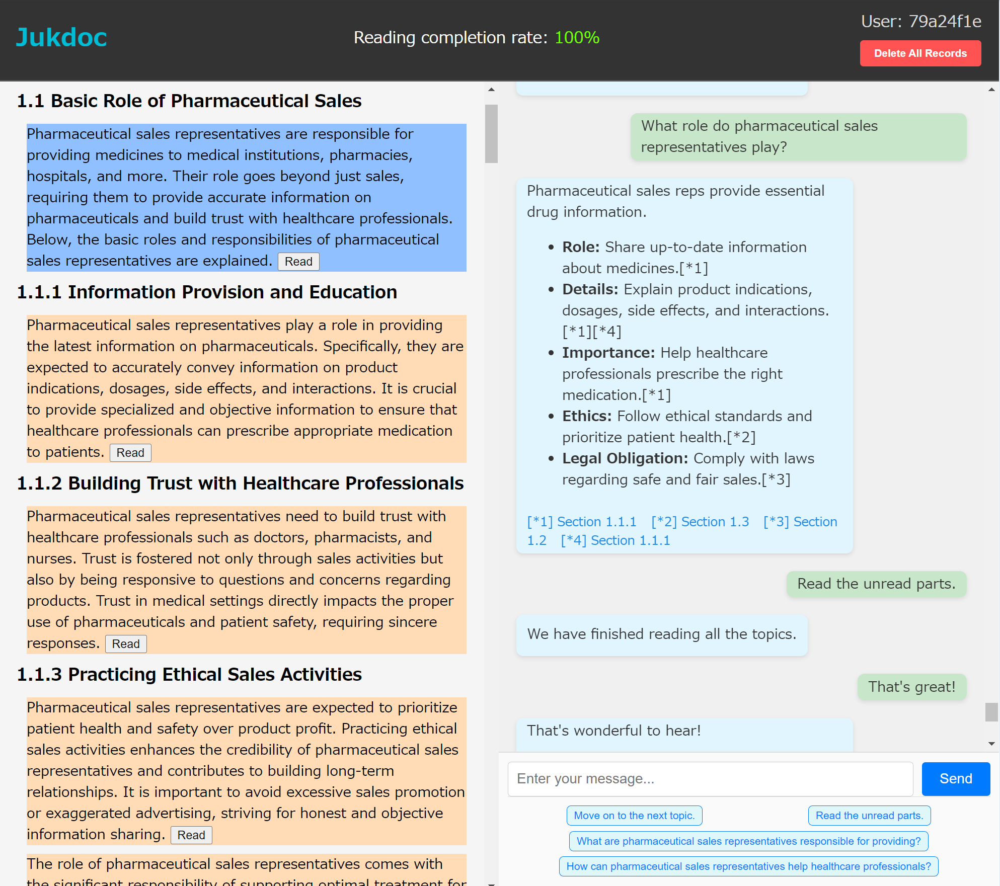

# Jukdoc

## Project Overview

Jukdoc is an onboarding training app supported by AI.

In the onboarding training, you typically need to study job-related documents, such as:

- Company overview materials
- Employee handbook
- Operations manual
- IT system usage guide
- Health and safety manual
- Compliance guidelines

These documents focus on job-specific knowledge within the company. You are expected to read each document thoroughly at least once.

Traditionally, training was conducted with human instructors and specialized texts. However, Jukdoc aims to replace much of this process with AI-based conversations.

**A unique feature of Jukdoc is that it visually indicates which parts of the document you have read and which are still unread, using color changes and a progress indicator.**

You can think of Jukdoc as an AI chat app that helps you read a document from start to finish. It’s not a general-purpose AI for answering any question, nor is it a support desk app. It’s also not intended for skimming or reading only portions of a document. When your completion rate reaches 100%, you can confidently say you have read the entire document.

