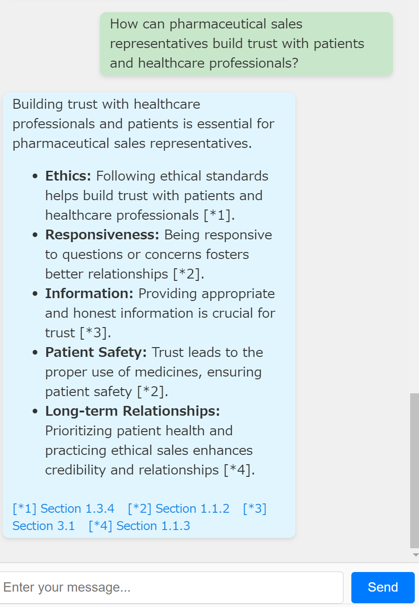
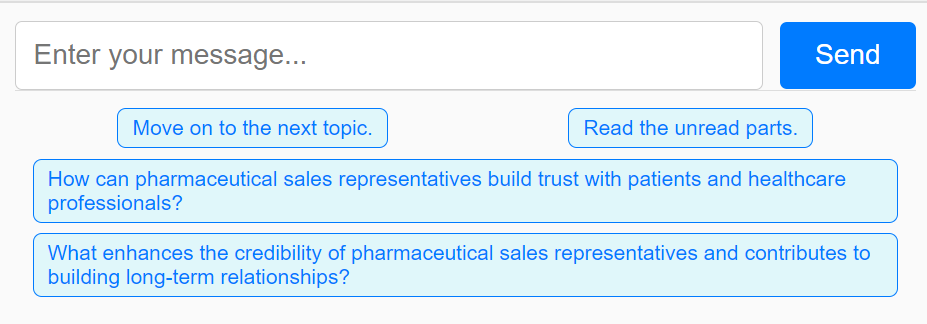

# Jukdoc

Jukdoc is an onboarding training app supported by AI.

# Project Overview

In the onboarding training, you typically need to study job-related documents, such as:

- Company overview materials
- Employee handbook
- Operations manual
- IT system usage guide
- Health and safety manual
- Compliance guidelines

These documents focus on job-specific knowledge within the company. You are expected to read each document thoroughly at least once.

Traditionally, training was conducted with human instructors and specialized texts. However, Jukdoc aims to replace much of this process with AI-based conversations.

**A unique feature of Jukdoc is that it visually indicates which parts of the document you have read and which are still unread, using color changes and a progress indicator.**

You can think of Jukdoc as an AI chat app that helps you read a document from start to finish. It’s not a general-purpose AI for answering any question, nor is it a support desk app. It’s also not intended for skimming or reading only portions of a document. When your completion rate reaches 100%, you can confidently say you have read the entire document.


# Setup and Run Instructions

## Technology Stack Overview

- Jakarta EE 10
- Payara Micro 6 with [Payara Starter](https://start.payara.fish/)
- [LangChain4j](https://github.com/langchain4j/langchain4j) with OpenAI API
- Built-in H2 database
- Maven
- Docker

## Prerequisites

- Java SE 21
- Docker
  - Install Docker Desktop if your OS is Windows.
- OpenAI API key
- The payara-micro-maven-plugin requires a specific web browser for development as it uses Selenium. You need to install Google Chrome on Windows and Firefox on Linux.
- I am testing the build of this project in Windows and WSL environments.

## Build

### Clone the repository

```shell
git clone https://github.com/sosuisen/jukdoc-ee.git
```

### Build .war and Docker image

Start Docker before running the following command.
On Linux and Mac systems, please change the line endings of the mvnw file to LF.

```shell
cd path-to-your-jukdoc-ee-repo
mvnw clean package
```


## Run

When you run the application, a chat app using sample data will start.

First, set your OpenAI API key as an environment variable named OPENAI_API_KEY.

For Windows, remember to restart the terminal to apply the environment variables.

### Running in Production Mode

```shell
mvnw clean package payara-micro:start
```
Opening http://localhost:8080/ will display the application.
(This URL will redirect to http://localhost:8080/jukdoc/)

### Running in Development Mode

Payara Starter provides a development mode that allows hot reloading. If there are any changes in the source code, the application will automatically rebuild and display updates in the browser.

To run in development mode, use the following command:

```shell
mvnw clean package payara-micro:dev
```
As a result, the browser will automatically open, displaying the application.

## Deployment

You can easily deploy Jukdoc application using Docker in the AWS cloud.
How to deploy Jukdoc on AWS Elastic Beanstalk is described in the following article:
https://www.payara.fish/resource/using-payara-platform-with-docker-on-amazon-aws/

Additional Notes for This Article:
- Starting in October 2024, to set up Auto Scaling on Elastic Beanstalk, you need to use a Launch Template. This requires adding settings in the .config files under the .ebextensions directory. In the jukdoc-ee repository, a configuration file (`.ebextensions/launch-template.config`) is already set up, so no additional changes are necessary.
- For instances supporting jukdoc-ee, the t3.micro instance type is too small. It is recommended to use t3.small, t3.medium, or a larger instance type to ensure adequate performance.

# How to Use

This app lets you explore a document through conversations with AI.
The jukdoc-ee repository includes sample data that has already been trained for onboarding training documents for pharmaceutical sales representatives. To train the AI model with your own data, refer to [How to Train an AI Model with Your Data](#how-to-train-an-ai-model-with-your-data).

The screen is divided into four main sections.

## Header Area

At the top is the header section.

- In the center, your completion rate for the document is displayed. Aim for 100% completion; it starts at 0%.
- On the far right, your username is shown. This username is automatically generated when you visit the site and is saved for the session, so it remains the same when you return.
  - However, if the server is restarted, the session will be lost, and your username will change.
- Below your username is the "Delete All Records" button. Pressing this deletes your reading history, resetting your completion rate to 0%.


## Document Area

On the left side is the document area, where the document you need to read is displayed.

- The system tracks your reading status per paragraph. Read paragraphs are marked with an orange background. When all paragraphs are read, your completion rate reaches 100%.
- At the end of each paragraph, there’s a "Read" button. When you click it, the AI explains the content of that paragraph. Once explained, the paragraph is marked as read.


## Chat Area

On the right side is the chat area, which you’ll use the most.

- Here, you can discuss the document on the left side with the AI.
- Send your questions about the document to the AI by pressing "Send." The AI will respond based on the document content.
- If the AI’s answer includes content from specific paragraphs, it will have reference symbols like [*1][*2]. The referenced paragraphs will then be marked as read.
- At the end of the answer, there will be a link to the referenced paragraph. Clicking it makes the document jump to that paragraph, which will have a blue background. You can read more details on any paragraph by clicking links while chatting with the AI.
- If the AI’s answer is not based on specific document content, it won’t include any paragraph references, and no paragraphs will be marked as read.



## Suggested Questions Area
 
- At the bottom of the chat area, suggested questions are displayed.
- If there are questions related to the AI’s last response, up to two suggestions will automatically appear here.
- You can also move to the next paragraph by selecting "Move on to the next topic."
- If you want to skip to unread paragraphs, select "Read the unread parts."



# How to Train an AI Model with Your Data

- The jukdoc-ee repository includes offline tools for training the AI with your document data.
- These tools are located in the net.sosuisen.offlineutils package (src/main/java/net/sosuisen/offlineutils/). Although offline tools are typically in separate repositories, they are included in the same repository as the web app for easier distribution. This package is not included in the .war file used for deployment.
- Utility scripts to start the offline tools are in the root directory of the jukdoc-ee repository, named run_*.sh. Change the line endings of these .sh files to LF.
